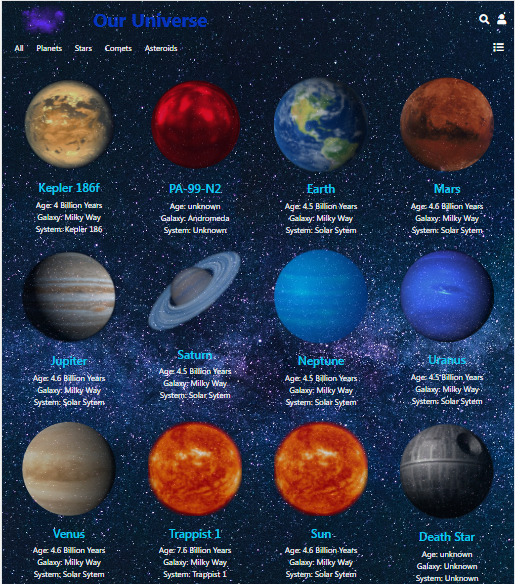
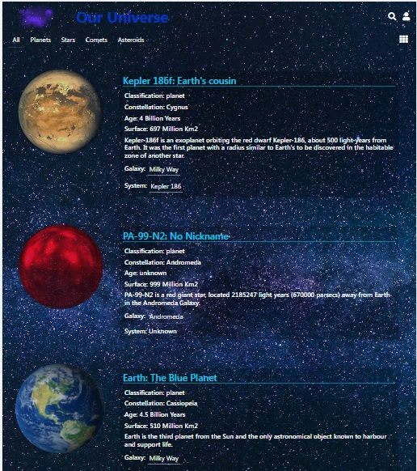
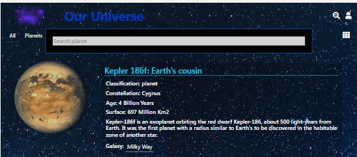
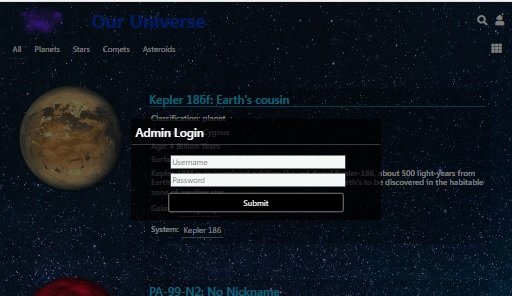
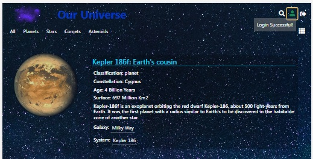
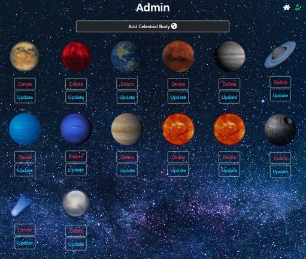
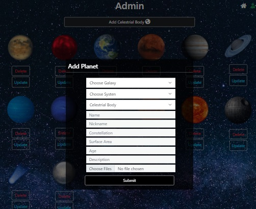

# The Universe

Project making use of Django for backend and React for Frontend to display planets.

## Features

Planets can be displayed in compact or detailed view and can be easily switched from one to another.

Searchbar with activation button.

Login Feature for admin functionality.

Admin page to add or delete planets.

Including modal for adding planets.

